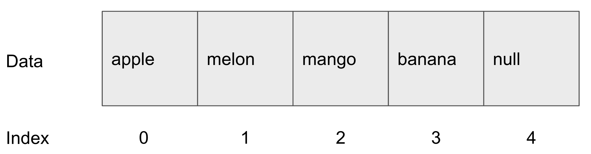

#Array

## Common Basic Theory

array is a sequential data structure.


in normal life we counting number from **1**,
because when we talking about number that's usually quantity like 1 apple, 1 liter of gas, 1 candy like that.  

But in **Array** index is not meaning quantity, it's talking about index. when we measure something use ruler we count from **0 (zero).** we are not count from 1.  
because 0 is starting point

the index is start from 0 same reason with ruler. the index meaning the start point of data set

## example code


1. define array name as fruitArray
2. print array index 0

### Javascript

```
let fruitArray = ['apple', 'melon', 'mango', 'banana', null]

console.log(fruitArray[0])
// apple
```
