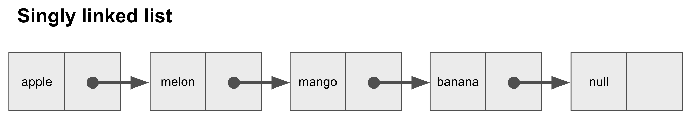
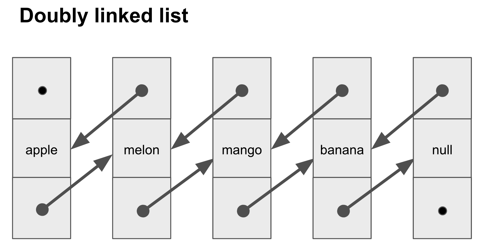
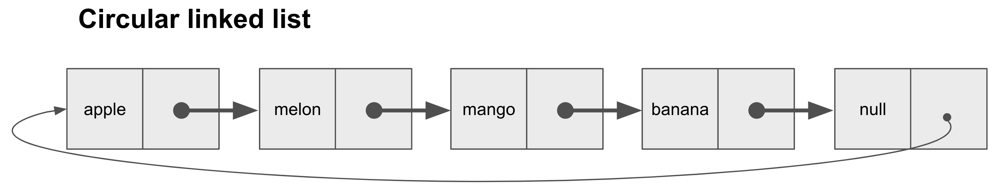

# [<- back](../../README.md)

 

# linked-list

linked list is linear data structure.

 

## Singly linked list

 

## Doubly linked list

 

## Multiply linked list

this structure is not handle for now

 

## Circular linked list

 

## why Linked-List than Array?

this is time to explain why we learn data structure.  
tell me. why really we do save data in data-structure?
because probably someday we want to access data. for that there is needs few technics for optimize performance

* insert data
* delete data
* sorting data
* searching data

and linked-list make this more easily 
